## Writing Test FE Bootcamp Week 3
Nama : Muhammad Arya Wirawan     
Track : Front End Web Development      
Group Track : 2      
Mentor : Thoriq Nur Faizal

### React Context
React Context menyediakan cara untuk berbagi data melalui component tree tanpa harus memberikan props kepada component dibawahnya secara manual di setiap levelnya. Fungsi context mirip dengan redux. Tujuannya yaitu untuk menghindari props drilling yang dalam.

Context didesain untuk membagikan data global untuk component-component dibawahnya. Contohnya seperti auth user, tema, preferensi bahasa dan lain-lain.      
Data yang bersifat global dapat kita simpan dalam context.

#### Membuat Context

Pertama, kita buat terlebih dahulu component context yang akan kita gunakan.    
Selanjutnya, kita dapat membuat context seperti berikut ini:            
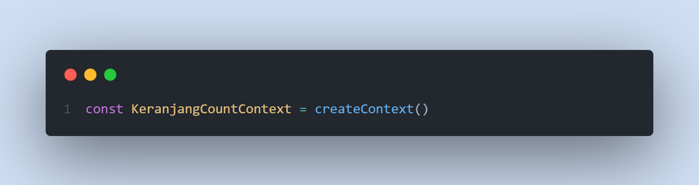     

Setelah itu, kita panggil contextnya dan kita tambahkan provider
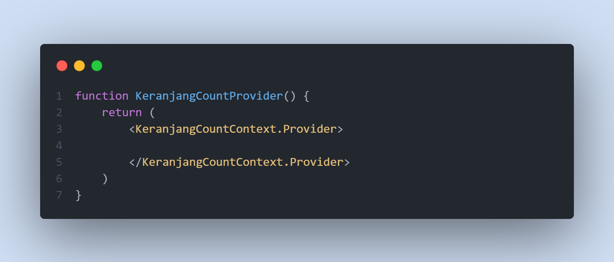

Setelah itu, kita buat state yang berisikan data nilai yang kita inginkan. kemudian kita tambahkan ke value provider
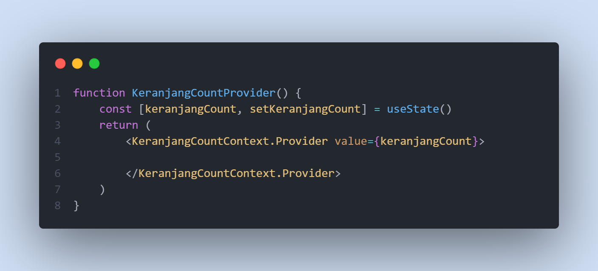        

Component context akan memprovide data untuk komponen dibawahnya.
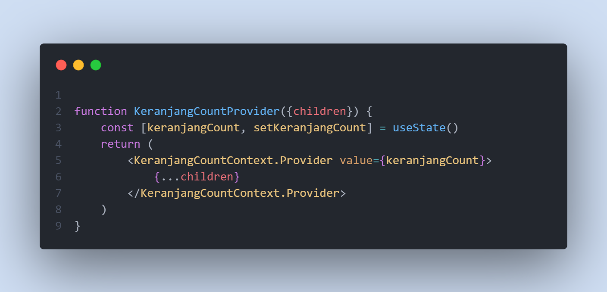      
 
Children akan berisikan App.js yang mana di dalam App.js terdapat banyak komponen. Nantinya, context akan memprovide data yang dibutuhkan oleh komponen-komponen tersebut
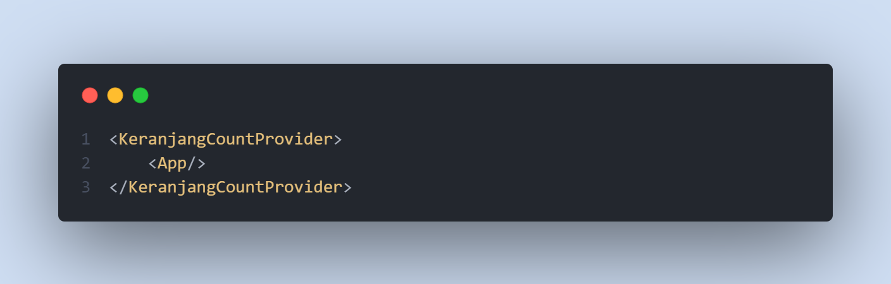    

Setelah itu, kita bungkus App dengan component yang telah kita buat tadi

#### Mengambil data dari context
Untuk mengambil data dari context, kita dapat menggunakan useContext()
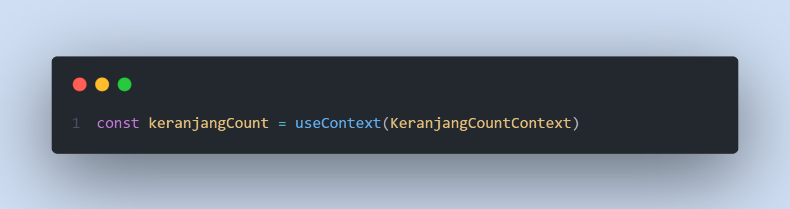

Agar context dapat menyebarkan beberapa data, kita dapat melakukannya dengan cara:
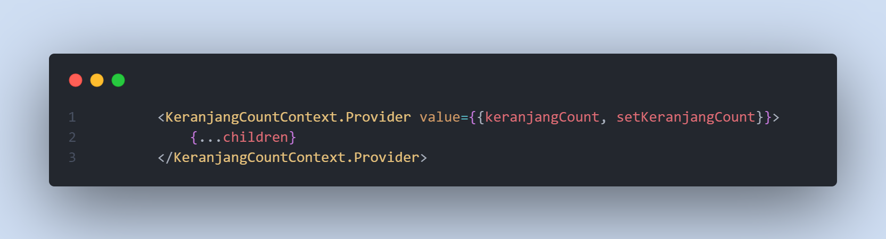     
Kita share data dengan membungkusnya dengan object. Untuk mengambil datanya, kita dapat destruktur data yang diberikan oleh context diatas
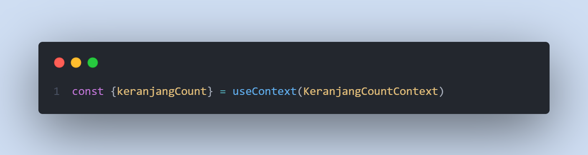         
### React Context - Use Reducer      
useReducer merupakan alternatif dari hooks useState. Penggunaannya mirip dengan redux. Use Reducer digunakan ketika kita kita akan mengubah data yang kompleks.
##### Membuat function reducer
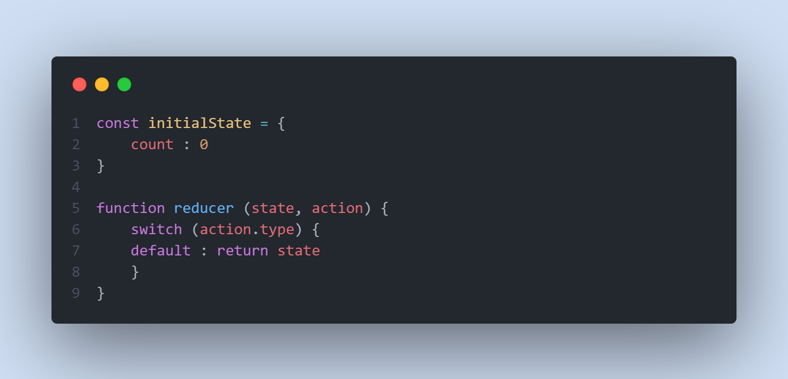        
Setelah membuat function reducer, kita masukkan function reducer tersebut ke dalam use reducer
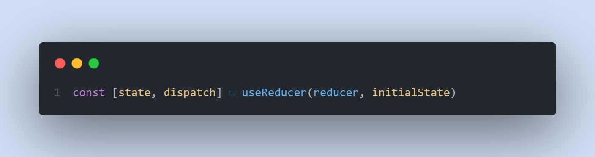     
Setelah itu, kita buat action untuk mengubah data dari state
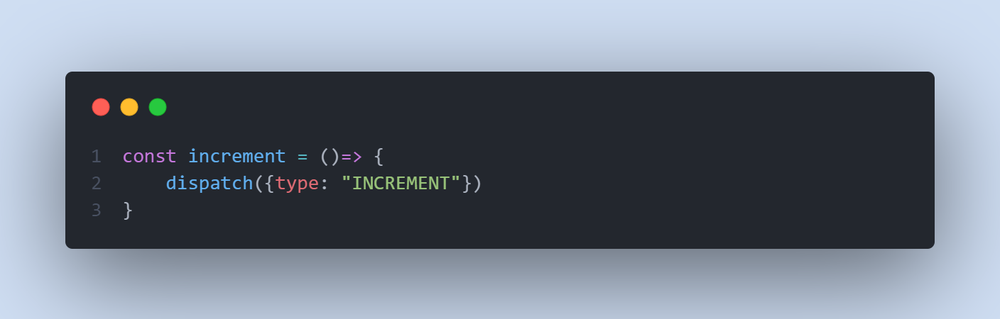

lalu kita buat switch casenya
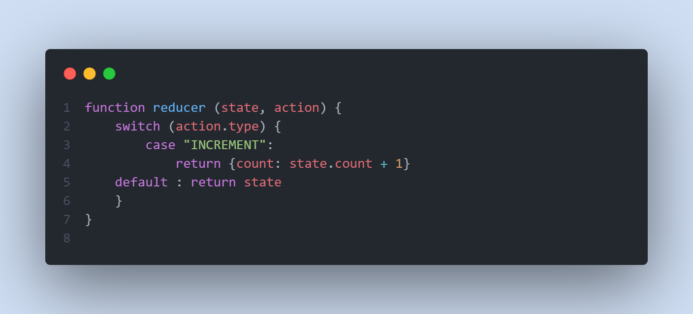    
Lalu kita panggil dengan useContext apabila kita memerlukan data counter tersebut.
### React Testing
Testing merupakan test yang dilakukan untuk mengetahui apakah code yang kita buat sudah sesuai dengan apa yang kita harapkan. Sebelumnya kita telah melakukan testing yaitu dengan menggunakan console.log. Testing menggunakan tersebut termasuk ke dalam manual testing. tipe testing selain manual testing yaitu automatic testing. Automation testing dilakukan dengan menggunakan code untuk mengecek program kita.

Automation testing dibagi menjadi 3
1. Unit Test = Melakukan pengujian terhadap unit/bagian kecil dari program
2. Integration Test = melakukan pengujian ketika terdapat hubungan dengan pihak/fitur lain
3. End To End = Melakukan pengujian terhadap seluruh proses dan bagian dari suatu program.

Unit test merupakan tingkatan yang memiliki cost paling rendah serta waktu yang paling cepat. sedangkan E2E memiliki cost yang paling mahal dan waktu yang cukup lama untuk melakukan testnya.


##### Menulis Testing
1. Buat fitur lalu testing => Dilakukan dengan melakukan code untuk membuat fitur terlebih dahulu lalu melakukan testing terhadap programnya
2. Buat testing lalu code fitur => Dilakukan dengan membuat testing terlebih dahulu lalu baru membuat code/fiturnya.

####TDD CIRCLE OF LIFE 
 - Red zone => Kondisi dimana testingnya masih gagal / tidak sesuai ekspektasi karena codenya belum ada
 - Green zone => Kondisi dimana code sudah dibuat dan memenuhi ekpektasi dari test yang sudah dibuat
 - Blue => refactoring. memperbarui code dan membuat code lebih efisien dengan tetap memenuhi ekspektasi yang telah dibuat

#####JEST

Jest merupakan salah satu framework yang digunakan untuk melakukan pengujian code javascript

```
npm install -D jest
```


Lalu kita dapat membuat tes code javascript   
Pertama, kita tulis ekspektasi kita   
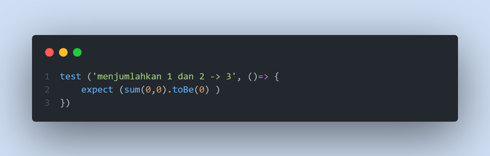      
lalu, kita buat functionnya
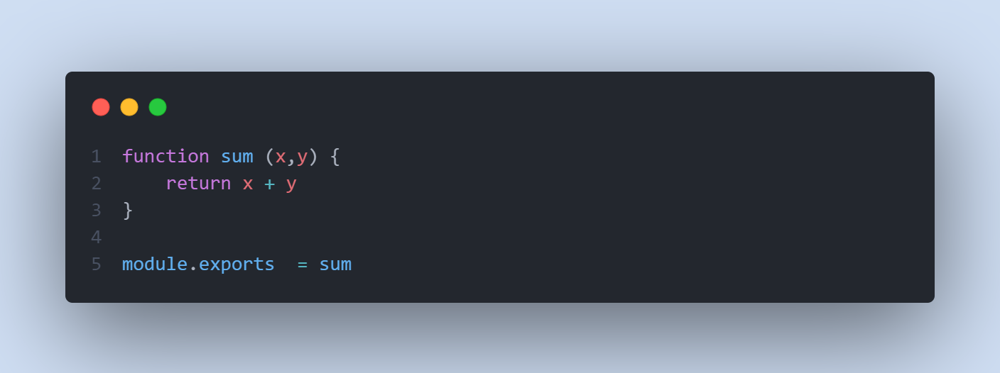     

Lalu kita jalankan jestnya. dan selesai. kita berhasil melakukan testing pada code kita. Contoh test berhasil:
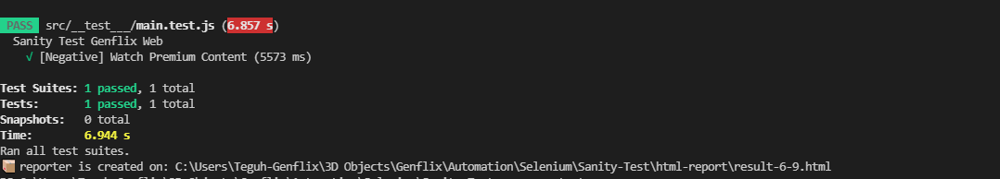